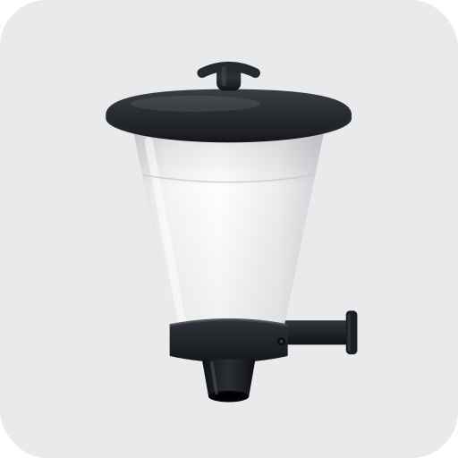
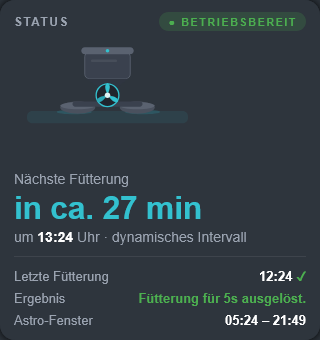
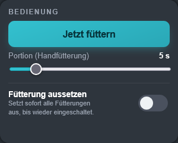
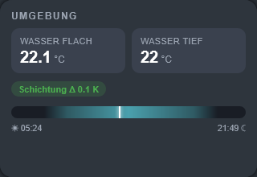
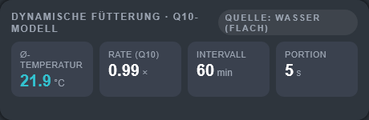
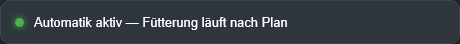
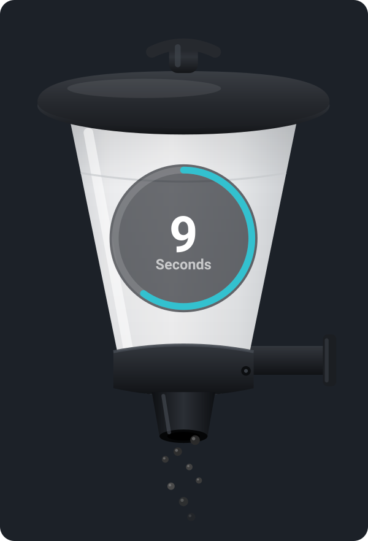
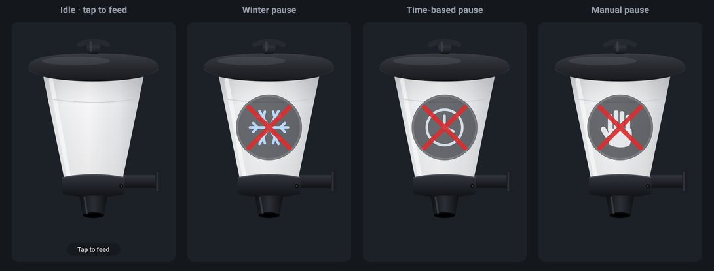
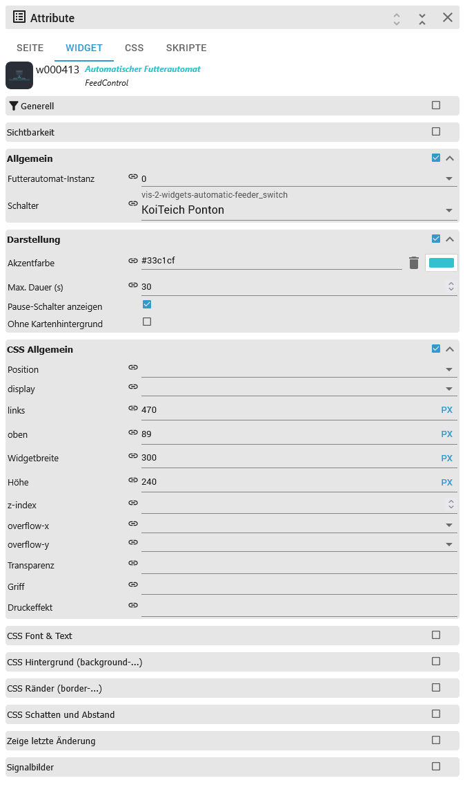

# ioBroker.vis-2-widgets-automatic-feeder

[](https://www.npmjs.com/package/iobroker.vis-2-widgets-automatic-feeder)
[](https://www.npmjs.com/package/iobroker.vis-2-widgets-automatic-feeder)

[](https://github.com/ssbingo/ioBroker.vis-2-widgets-automatic-feeder/blob/main/LICENSE)

---

<p align="center">
  <a href="https://www.buymeacoffee.com/ssbingo"></a>
</p>

---

## vis-2 widgets for the Automatic Feeder

Ready-made **vis-2 dashboard widgets** for the
[ioBroker.automatic-feeder](https://github.com/ssbingo/ioBroker.automatic-feeder) adapter — drag-and-drop cards for a
fish / koi / pond feeder. There are **no object IDs to look up and no HTML to write**: you pick your feeder instance
and your feeder switch **by its friendly name** from a dropdown, and every widget reads and controls the right data
points on its own.

This package ships **six widgets** that together form a complete feeder dashboard, in a dark, tablet-friendly card
design with an accent colour you can change. Four widgets only *display* data; two also let you *act* (trigger a
one-off feeding, or suspend feeding).

> This is only the **visualization layer**. All scheduling, the temperature model, sunrise/sunset logic, pauses and
> notifications live in the separate **ioBroker.automatic-feeder** adapter; these widgets are a live view onto — and a
> remote control for — that adapter. (In the wider smart-pond family the sibling *pond-aeration* adapter can, for
> example, pause aeration while the feeder feeds — but that is configured over there, not here.)

This document is a complete manual. If you have never used these widgets before, read it top to bottom: the
**Quick start** gets you a working card in about a minute, and the rest explains every widget and every option in
detail.

> 🇩🇪 Deutsche Anleitung: [doc/de/README.md](doc/de/README.md) · other languages: see
> [Documentation](#documentation) at the bottom.

---

## Table of contents

1. [What are vis-2 widgets?](#1-what-are-vis-2-widgets)
2. [What you get](#2-what-you-get)
3. [Requirements](#3-requirements)
4. [Installation](#4-installation)
5. [Quick start](#5-quick-start)
6. [The widgets in detail](#6-the-widgets-in-detail)
   - [6.1 FeederStatus](#61-feederstatus)
   - [6.2 FeedControl](#62-feedcontrol)
   - [6.3 Environment](#63-environment)
   - [6.4 DynamicFeeding](#64-dynamicfeeding)
   - [6.5 SeasonBanner](#65-seasonbanner)
   - [6.6 AnimatedFeeder](#66-animatedfeeder)
7. [Configuration & bindings](#7-configuration--bindings)
8. [Which data points each widget uses](#8-which-data-points-each-widget-uses)
9. [Development](#9-development)
10. [Troubleshooting & FAQ](#10-troubleshooting--faq)

---

## 1. What are vis-2 widgets?

**vis-2** is ioBroker's modern visualization tool (the successor to classic *vis 1*). You build dashboards ("views")
by dragging **widgets** — buttons, gauges, cards — onto a canvas and connecting them to your device states.

Normally you connect a widget to a state by hand: you look up an object ID (something like
`automatic-feeder.0.switches.sw-0.status.feedingActive`) and type it into a binding field. That is fine for one
value, but a good feeder card needs a dozen of them working together.

A **widget set** like this one solves that: it is an add-on that ships **purpose-built widgets** for one adapter. Each
widget already knows which states it needs. You only tell it **which feeder** to show — everything else is wired up for
you. So instead of a dozen manual bindings you make **two clicks** (instance + switch) and get a finished card.

---

## 2. What you get

Six widgets. Each is a self-contained card; you can use just one or combine them into a full dashboard.

| Widget | What it shows / does | Writes? |
|--------|----------------------|---------|
| **FeederStatus** | The main status card: an animated feeder graphic (the fan spins while feeding), a live runtime countdown, the countdown to the **next** feeding with time and mode, the **last** feeding and its result, the astronomical (sunrise/sunset) window and — when blocked — the reason. | no |
| **FeedControl** | A **Feed now** button with two-step confirmation, a portion (duration) slider and a master **Suspend feeding** switch. | yes |
| **Environment** | Water temperature (shallow and deep), the thermal stratification Δ, an oxygen reading (only if a sensor exists) and a sunrise→sunset day bar with a live "now" marker. | no |
| **DynamicFeeding** | The adapter's **Q10** temperature model at a glance: average temperature, rate factor, interval and portion, plus which sensor (water/air) drives it. | no |
| **SeasonBanner** | A single, colour-coded status line showing the currently most important state (manual pause → time-based pause → winter pause → automatic active). | no |
| **AnimatedFeeder** | A large animated feeder on a canvas: food pellets fall and a countdown ring fills while feeding, pause symbols (manual / time / winter) otherwise. **Tap it to trigger a one-off feeding.** | yes |

The two "writing" widgets (**FeedControl**, **AnimatedFeeder**) only ever write when *you* click/tap — nothing is
changed on its own.

In the vis-2 widget palette the whole set appears under the group name **Automatic Feeder**.

---

## 3. Requirements

- **ioBroker** with **vis-2** installed (the modern vis). These are vis-2 widgets and do **not** work in classic
  vis 1.
- The **ioBroker.automatic-feeder** adapter, installed and configured with **at least one switch** (a "switch" is one
  feeder in the adapter's configuration; it has a friendly name such as *KoiTeich Ponton*). Recommended adapter
  versions:
  - **v1.4.0 or newer** — required, for the numeric timestamps, the `blockReasonCode` and the `feedFor` command the
    widgets rely on.
  - **v1.5.0 or newer** — recommended, additionally enables the live **runtime countdown** in FeederStatus
    (the `status.feedingEndsTs` data point).
  - **v1.6.0 or newer** — recommended for the exact countdown ring in **AnimatedFeeder** (the
    `status.feedingDurationSec` data point).

You never have to enter an object ID by hand: the widgets read and write only the selected switch's own `status.*` and
`settings.*` data points, resolved from the instance + switch you pick.

---

## 4. Installation

1. Install **ioBroker.vis-2-widgets-automatic-feeder** in ioBroker — from the admin **Adapters** list once it is in
   the repository, or directly from GitHub / npm. It installs as a *visualization-widgets* adapter (`onlyWWW`, no
   running instance is created).
2. Open **vis-2**. A new widget group **Automatic Feeder** appears in the widget palette (left-hand side, in edit
   mode).
3. Drag any of its widgets onto a view — see the [Quick start](#5-quick-start) below.

> **After every update:** run `iobroker upload vis-2-widgets-automatic-feeder`, then restart vis-2 (installing the
> adapter already flags vis-2 for a restart) and do a hard refresh (Ctrl+F5) in the browser, so the runner picks up the
> new widget bundle. See [Troubleshooting](#10-troubleshooting--faq).

---

## 5. Quick start

1. In vis-2, switch to **edit mode**, open a view and drag the **FeederStatus** widget from the **Automatic Feeder**
   group onto it.
2. With the widget selected, open the **Attributes** panel on the right and fill the two fields in the **common**
   group:
   - **Feeder instance** — pick your `automatic-feeder` instance (usually `0`; this is a standard instance picker).
   - **Switch** — pick your feeder from the dropdown. It lists your configured switches **by their friendly name**
     (e.g. *KoiTeich Ponton*), read straight from the adapter's own configuration.
3. The card immediately shows live data. Repeat for any other widget — the instance/switch selection works exactly the
   same for all six.

That is all: no object IDs, no manual bindings, no scripts. Until both fields are set, a widget shows a friendly
*"Select the feeder switch channel in the widget settings."* hint instead of data.

---

## 6. The widgets in detail

Every widget shares the same two required settings — **Feeder instance** and **Switch** — in the **common** attribute
group (see [Configuration & bindings](#7-configuration--bindings)). The per-widget appearance options are listed with
each widget below. All screenshots show live data from a real koi-pond feeder.

### 6.1 FeederStatus



The main card. From top to bottom it shows:

- A **status pill**: **Ready** (green) or **blocked** (amber). "blocked" means the adapter is currently not allowed to
  feed (night, temperature too low, oxygen too low, a pause …).
- An **animated feeder graphic**. While a feeding runs the fan spins and — with adapter v1.5.0+ — a **runtime
  countdown** (e.g. `5 s`) appears next to it and counts down to the end of the current feeding.
- The **next feeding**: a large countdown (*in approx. 27 min*, or `1 h 05 min` past an hour), the exact time, and the
  mode (*dynamic interval* when dynamic feeding is on, otherwise *schedule*).
- The **last feeding** with a ✓ (success, green) or ✗ (error, red) marker and the adapter's **result** text.
- The **astro window** (sunrise – sunset) used for the day/night logic.
- When blocked, an extra **reason** line with the human-readable block reason (in amber).

The card re-renders once per second so the countdowns stay live.

**Appearance options** (group *Appearance*):

| Option | Type | Default | Meaning |
|--------|------|---------|---------|
| **Accent colour** | colour | `#33c1cf` | Highlight colour of the card and graphic. |
| **Runtime timer position** | select (Right / Left) | Right | Show the running-feeding countdown left or right of the graphic. |
| **Animate feeder graphic** | checkbox | on | Turn the spinning-fan animation on/off. |
| **No card background** | checkbox | off | Render without the card background (to place it on your own panel). |

Default widget size: 320 × 340 px.

### 6.2 FeedControl



The control card:

- **Feed now** — a **two-step** button. The first click *arms* it and the label changes to *Confirm: N s ?*; the
  second click triggers exactly **one** feeding of the chosen duration and briefly shows *Triggered ✓*. If you do not
  confirm within ~4 seconds it disarms itself.
- **Portion (manual)** — a slider that sets the feeding duration in seconds, from `1` up to *Max. duration* (default
  starts at 5 s).
- **Suspend feeding** — a master switch that immediately suspends **all** feeding for this switch until you turn it
  back off. It writes the adapter's `settings.pauseNow`, which overrides every mode and every time-based pause.

**Appearance options** (group *Appearance*):

| Option | Type | Default | Meaning |
|--------|------|---------|---------|
| **Accent colour** | colour | `#33c1cf` | Highlight colour. |
| **Max. duration (s)** | number (1–3600) | 30 | Upper end of the portion slider. |
| **Show pause switch** | checkbox | on | Show/hide the master *Suspend feeding* switch. |
| **No card background** | checkbox | off | Render without the card background. |

Default widget size: 300 × 240 px.

> The button writes a **one-off** feeding via the adapter's `feedFor` command (value = duration in seconds). It does
> **not** change your schedule and does **not** restart the adapter.

### 6.3 Environment



The water/environment card:

- **Water shallow** and **Water deep** temperatures (in °C, rounded to 0.1). The deep tile stays at `–` if you did not
  configure a second, deeper sensor.
- A **Stratification** pill showing the difference Δ between the two layers (in K). It turns amber when the layers
  differ by more than **3 K**.
- An **O₂** pill in mg/l — shown **only** when an oxygen sensor is configured, and turning red when the value falls
  below the configured minimum (`settings.o2Min`).
- A **day bar** from sunrise (☀) to sunset (☾) with a live marker for the current time (recomputed every minute).

**Appearance options** (group *Appearance*):

| Option | Type | Default | Meaning |
|--------|------|---------|---------|
| **Accent colour** | colour | `#33c1cf` | Highlight colour. |
| **No card background** | checkbox | off | Render without the card background. |

Default widget size: 320 × 220 px.

### 6.4 DynamicFeeding



Shows the **Q10 temperature model** the adapter uses to adapt feeding to the water temperature. Four tiles:

- **Avg. temperature** — the averaged temperature the model is based on (°C).
- **Rate (Q10)** — the resulting rate factor (× relative to the reference temperature).
- **Interval** — the resulting feeding interval in minutes.
- **Portion** — the resulting feeding duration in seconds.

A **Source** pill in the header shows whether the model is driven by the **Water (shallow)** or the **Air** sensor
(`settings.dynamicSource`). If dynamic feeding is switched off for this switch, the card shows the hint *"Dynamic
feeding is off for this switch."* instead of the tiles.

**Appearance options** (group *Appearance*):

| Option | Type | Default | Meaning |
|--------|------|---------|---------|
| **Accent colour** | colour | `#33c1cf` | Highlight colour of the Avg. temperature tile. |
| **No card background** | checkbox | off | Render without the card background. |

Default widget size: 460 × 150 px.

### 6.5 SeasonBanner



A single, colour-coded status line — ideal for the top of a view. It always shows the **most important** current
state, in this order of priority:

1. **Manual pause** (red) — the master pause switch (`status.pauseManual`) is on.
2. **Time-based pause** (amber) — a configured pause window is active (`status.pauseActive`), with its end time
   appended (`status.pauseActiveUntil`).
3. **Winter pause** (blue) — the winter window is active (`status.winterActive`).
4. **Automatic active** (green) — nothing blocks feeding, the schedule runs normally.

This widget has **no** appearance options beyond the two common settings (instance + switch).

Default widget size: 460 × 44 px.

### 6.6 AnimatedFeeder



A large, animated feeder rendered on an HTML `<canvas>` — the visual centrepiece of a pond dashboard. It reacts live to
the switch:

- **While feeding:** food pellets fall from the outlet and a **countdown ring** with the remaining seconds fills.
  The ring is exact when the adapter provides `status.feedingDurationSec` (**v1.6.0+**); with older adapters the total
  duration is derived from the moment the feeding starts.
- **Pause states**, shown as a symbol on a disc with a red cross, in the same priority as the SeasonBanner:
  **manual pause** (hand) → **time-based pause** (clock) → **winter pause** (snowflake).
- **Idle:** just the feeder, with an optional *"Tap to feed"* hint.



**Tap to feed:** tap the widget once to arm it (*Confirm: N s ?*), tap again to trigger a one-off feeding of the
configured duration (via `feedFor`). Tapping is ignored while a pause is active or a feeding is already running, and
the whole feature can be turned off with **Enable tap-to-feed**. (The falling-pellet animation is automatically
reduced when the operating system requests reduced motion.)

**Options** — the AnimatedFeeder has three attribute groups:

*Behaviour:*

| Option | Type | Default | Meaning |
|--------|------|---------|---------|
| **Enable tap-to-feed** | checkbox | on | Allow triggering a feeding by tapping the widget. |
| **Feed duration (s)** | number (1–3600) | 5 | Duration written by the tap action. |
| **Animate feeder graphic** | checkbox | on | Turn the falling-pellet animation on/off. |

*Appearance:*

| Option | Type | Default | Meaning |
|--------|------|---------|---------|
| **Accent colour** | colour | `#33c1cf` | Colour of the countdown ring and hint. |
| **Image (optional)** | image | *(built-in)* | Custom feeder image; leave empty for the built-in graphic. A custom image may have a different aspect ratio. |
| **No card background** | checkbox | off | Render without the card background. |

*Geometry* — positions are in **%** of the widget, so the animation can be aligned when you use your own image:

| Option | Type | Default | Range |
|--------|------|---------|-------|
| **Pellet outlet X (%)** | number | 50 | 0–100 |
| **Pellet outlet Y (%)** | number | 80 | 0–100 |
| **Countdown X (%)** | number | 50 | 0–100 |
| **Countdown Y (%)** | number | 44 | 0–100 |
| **Countdown size (%)** | number | 20 | 5–45 |

Default widget size: 300 × 440 px.

---

## 7. Configuration & bindings

Every widget has the same two required settings in the **common** attribute group:



- **Feeder instance** — choose your `automatic-feeder` instance from the dropdown (usually `0`). Accepts either the
  plain number (`0`) or the full form (`automatic-feeder.0`).
- **Switch** — choose the feeder from a dropdown that lists your configured switches **by their friendly name** (e.g.
  *KoiTeich Ponton*), not by an internal id. The list is read from the selected instance's configuration
  (`system.adapter.automatic-feeder.<instance>` → `native.switches[]`).

From these two values the widget builds the switch channel
`automatic-feeder.<instance>.switches.<switch>` and subscribes to the relative sub-states it needs — you never type a
binding yourself. Until both fields are set, a widget shows a *"Select the feeder switch channel…"* hint instead of
data.

The optional appearance settings live in each widget's **Appearance** group (and, for AnimatedFeeder, in **Behaviour**
and **Geometry**); see each widget above. Common options across widgets:

| Option | Widgets | Meaning |
|--------|---------|---------|
| **Accent colour** | all except SeasonBanner | The highlight colour (default pond-aqua `#33c1cf`). |
| **No card background** | all except SeasonBanner | Render the widget without its card background, e.g. to place it on a custom panel. |

---

## 8. Which data points each widget uses

For full transparency — the widgets subscribe to the switch channel
`automatic-feeder.<instance>.switches.<switch>.…` and use only these relative data points:

| Widget | Reads | Writes |
|--------|-------|--------|
| **FeederStatus** | `status.feedingActive`, `status.feedingEndsTs`, `status.nextFeeding`, `status.nextFeedingTs`, `status.lastFeeding`, `status.lastResult`, `status.blocked`, `status.blockReasonCode`, `status.blockReason`, `status.error`, `status.sunrise`, `status.sunset`, `settings.dynamicEnabled` | — |
| **FeedControl** | `status.pauseManual`, `status.feedingActive` | `feedFor` (one-off feeding, value = seconds), `settings.pauseNow` (suspend toggle) |
| **Environment** | `status.waterTemperature`, `status.waterTemperatureDeep`, `status.waterStratification`, `status.oxygen`, `status.sunrise`, `status.sunset`, `status.sunriseTs`, `status.sunsetTs`, `settings.o2Min` | — |
| **DynamicFeeding** | `settings.dynamicEnabled`, `settings.dynamicSource`, `status.dynamicAvgTemperature`, `status.dynamicRate`, `status.dynamicIntervalMin`, `status.dynamicDurationSec` | — |
| **SeasonBanner** | `status.winterActive`, `status.pauseActive`, `status.pauseActiveUntil`, `status.pauseManual`, `settings.winterWindow` | — |
| **AnimatedFeeder** | `status.feedingActive`, `status.feedingEndsTs`, `status.feedingDurationSec`, `status.winterActive`, `status.pauseManual`, `status.pauseActive` | `feedFor` (tap-to-feed, value = seconds) |

See the [ioBroker.automatic-feeder documentation](https://github.com/ssbingo/ioBroker.automatic-feeder) for the exact
meaning of each data point.

---

## 9. Development

The widgets are written in **TypeScript + React 18** (with MUI for the attribute editors) and bundled with **Vite**
and **Module Federation** into a single `customWidgets.js` that vis-2 loads at runtime. The source lives in
[`src-widgets-ts/src/`](src-widgets-ts/src/):

| File | Widget / role |
|------|---------------|
| `FeederWidgetBase.tsx` | Shared base class used by **four** of the widgets (Environment, DynamicFeeding, SeasonBanner, AnimatedFeeder): resolves the switch channel, subscribes to the sub-states, keeps values in state, and offers read/write/format helpers. FeederStatus and FeedControl extend `window.visRxWidget` directly and do their own subscribe/seed. |
| `common.tsx` | The shared *common* attribute group (instance picker + the "switch by name" dropdown) and the `channelOf()` helper. |
| `FeederStatus.tsx`, `FeedControl.tsx`, `Environment.tsx`, `DynamicFeeding.tsx`, `SeasonBanner.tsx`, `AnimatedFeeder.tsx` | The six widgets. |
| `styles.ts` | The injected CSS for the card design. |
| `translations.ts` + `i18n/*.json` | UI texts in 11 languages. |

The widget set is registered in [`io-package.json`](io-package.json) under `common.visWidgets.vis2AutomaticFeeder`
(components `FeederStatus`, `FeedControl`, `Environment`, `DynamicFeeding`, `SeasonBanner`, `AnimatedFeeder`).

**Build & scripts** (run from the repository root):

```bash
npm run npm      # install root + src-widgets-ts dependencies
npm run build    # build the TypeScript widgets → widgets/vis-2-widgets-automatic-feeder/
npm run lint     # ESLint over src-widgets-ts
npm test         # @iobroker/testing package tests (mocha test/package)
```

`npm run build` runs `node tasks --typescript`, which cleans, builds `src-widgets-ts` with Vite and copies
`customWidgets.js`, the assets, images and icon set into `widgets/vis-2-widgets-automatic-feeder/` (the folder shipped
to end users; `main` points at its `customWidgets.js`). Releases are cut with the `@alcalzone/release-script`
(`npm run release-patch` / `-minor` / `-major`), which also runs the build before committing.

---

## 10. Troubleshooting & FAQ

**A widget only shows "Select the feeder switch channel…".**
Set both **common** fields (instance *and* switch). The switch dropdown is filled from the selected instance, so pick
the instance first.

**The switch dropdown is empty.**
The chosen `automatic-feeder` instance has no configured switches yet, or the instance number is wrong. Configure a
switch in the adapter first.

**Values show `–`.**
Make sure the adapter is **v1.4.0 or newer** (v1.5.0+ for the runtime countdown). Older versions do not provide the
numeric timestamps and command data points the widgets rely on. The **Water deep** tile stays `–` unless you
configured a second, deeper sensor; the **O₂** pill is hidden unless an oxygen sensor is configured — both are normal.

**The runtime countdown never appears.**
It needs adapter **v1.5.0+** (`status.feedingEndsTs`) and is only shown *while a feeding is actually running*.

**The AnimatedFeeder countdown ring is not exactly proportional.**
The exact ring needs adapter **v1.6.0+** (`status.feedingDurationSec`); with older adapters the duration is estimated
from the feeding-start time, so the ring is approximate.

**New/updated widgets don't appear, or only some are visible.**
This is almost always a stale widget bundle in the browser/runner. Run
`iobroker upload vis-2-widgets-automatic-feeder`, restart vis-2 (or the host), and hard-refresh the browser (Ctrl+F5).

**Does this replace the adapter?**
No. These are only the dashboard widgets. All scheduling, temperature logic, pauses and notifications live in the
**ioBroker.automatic-feeder** adapter; the widgets are a view onto — and a remote for — it.

---

## Changelog
<!--
	Placeholder for the next version (at the beginning of the line):
	### **WORK IN PROGRESS**
-->
### 0.2.1 (2026-07-07)
* (ssbingo) Fixed **AnimatedFeeder** showing nothing in Firefox: the built-in feeder image now uses a base64 data URI (Firefox rejects the non-standard `;utf8,` form that Chrome tolerated) and the canvas 2D context is initialised from the `<canvas>` ref callback, so it binds reliably regardless of mount order. A failed or zero-size custom image can no longer blank the whole widget

### 0.2.0 (2026-07-07)
* (ssbingo) New sixth widget **AnimatedFeeder**: a large animated feeder (canvas) with falling pellets, a countdown ring and pause symbols (manual / time-based / winter); tap it to trigger a one-off feeding. The exact countdown ring uses the adapter's new `status.feedingDurationSec` (**automatic-feeder v1.6.0+**)
* (ssbingo) New stylized adapter and widget-set icon (feeder on a light grey tile)

### 0.1.0 (2026-07-07)
* (ssbingo) Fixed the adapter icon not showing in the ioBroker Developer Portal — `extIcon` and `readme` now point to the real repository instead of the template placeholder

### 0.0.5 (2026-07-06)
* (ssbingo) Internal: the package test now uses the standard `@iobroker/testing` test suite (`tests.packageFiles`) so the ioBroker adapter checker can verify it

### 0.0.4 (2026-07-06)
* (ssbingo) Internal/CI: adopted the ioBroker standard workflow actions (`ioBroker/testing-action-check`, `ioBroker/testing-action-deploy`) — still token-less npm trusted publishing (OIDC) with provenance — and the standard Dependabot auto-merge workflow

### 0.0.3 (2026-07-06)
* (ssbingo) Full user manual with screenshots of every widget, plus translations in all 11 languages (`doc/<lang>/README.md`)
* (ssbingo) Repository and CI hardening: added a `check-and-lint` job, committed the root `package-lock.json`, replaced the broken Dependabot auto-merge with the GitHub-native flow, moved Dependabot to a distributed cron schedule and added `.vscode` JSON-schema settings; first release published with provenance via the npm Trusted Publisher pipeline

### 0.0.2 (2026-07-06)
* (ssbingo) All five widgets now register correctly; widget preview uses the feeder icon instead of the template demo image; the adapter installs straight from GitHub (removed the puppeteer-based demo test)

### 0.0.1 (2026-07-06)
* (ssbingo) Initial version with five widgets — FeederStatus, FeedControl, Environment, DynamicFeeding and SeasonBanner — for the ioBroker.automatic-feeder adapter, configurable by feeder instance and switch name

---

[Older changelogs can be found there](CHANGELOG_OLD.md)

## Documentation

- 🇩🇪 [Deutsche Dokumentation](doc/de/README.md)
- 🇷🇺 [Документация на русском](doc/ru/README.md)
- 🇳🇱 [Nederlandse documentatie](doc/nl/README.md)
- 🇫🇷 [Documentation française](doc/fr/README.md)
- 🇮🇹 [Documentazione italiana](doc/it/README.md)
- 🇪🇸 [Documentación en español](doc/es/README.md)
- 🇵🇱 [Dokumentacja polska](doc/pl/README.md)
- 🇵🇹 [Documentação portuguesa](doc/pt/README.md)
- 🇺🇦 [Документація українською](doc/uk/README.md)
- 🇨🇳 [简体中文文档](doc/zh-cn/README.md)

## License

MIT License

Copyright (c) 2026 ssbingo <silvio.sternitzke@googlemail.com>

Permission is hereby granted, free of charge, to any person obtaining a copy
of this software and associated documentation files (the "Software"), to deal
in the Software without restriction, including without limitation the rights
to use, copy, modify, merge, publish, distribute, sublicense, and/or sell
copies of the Software, and to permit persons to whom the Software is
furnished to do so, subject to the following conditions:

The above copyright notice and this permission notice shall be included in
all copies or substantial portions of the Software.

THE SOFTWARE IS PROVIDED "AS IS", WITHOUT WARRANTY OF ANY KIND, EXPRESS OR
IMPLIED, INCLUDING BUT NOT LIMITED TO THE WARRANTIES OF MERCHANTABILITY,
FITNESS FOR A PARTICULAR PURPOSE AND NONINFRINGEMENT. IN NO EVENT SHALL THE
AUTHORS OR COPYRIGHT HOLDERS BE LIABLE FOR ANY CLAIM, DAMAGES OR OTHER
LIABILITY, WHETHER IN AN ACTION OF CONTRACT, TORT OR OTHERWISE, ARISING FROM,
OUT OF OR IN CONNECTION WITH THE SOFTWARE OR THE USE OR OTHER DEALINGS IN
THE SOFTWARE.
